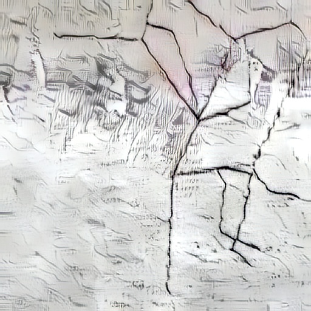
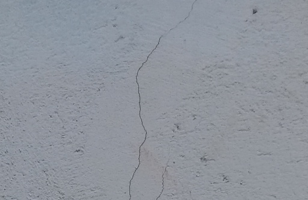
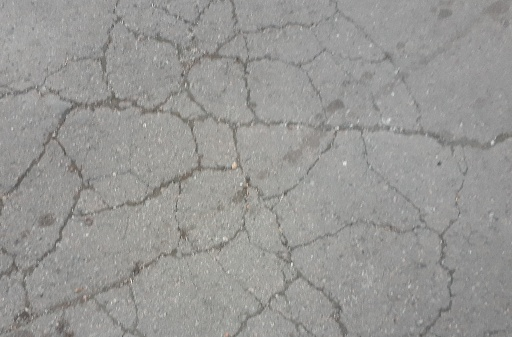

  
  
TODO: poster

  <a href="#overview">Overview</a> •
  <a href="#download">Download</a> •
  <a href="#samples">Samples</a> •
  <a href="#license">License</a>
  

TODO: shields
<!--  

 -->

# Cracks Synthetic Dataset

# Overview

### Dataset contains:
- 1158 synthetic images with Ground Truth *(source_synthetic)*
- 400 synthetic images with Ground Truth with Style Transfer Augmentation *(source_synthetic_styled)*
- 628 real images **without** Ground Truth *(target_unlabeled)*
- 70 real images with Ground Truth for **Validation** *(validation)*

### Project structure:

### How the data was generated

We have collected about 200 real photos (or textures) of asphalt, wall, concrete and other images of various materials that are used as a background. Then we overlaid these textures with procedurally generated cracks. To embed the cracks in the texture and make it more realistic, we apply some post-processing algorithm. Also, there is a subset of 400 images which were obtained by applying [Style Transfer](https://arxiv.org/abs/2003.07694) model to increase the variety of the data.

# Download
Direct download links:
- [zip](https://github.com/supervisely-ecosystem/cracks-synthetic-dataset/archive/refs/tags/v0.0.2.zip)
- [tar.gz](https://github.com/supervisely-ecosystem/cracks-synthetic-dataset/archive/refs/tags/v0.0.2.tar.gz)

# Samples

| source_synthetic | source_synthetic_styled | target_unlabeled | validation |
| ---------------- | ----------------------- | ---------------- | ---------- |
|  |  |  |  |

# License

TODO: License